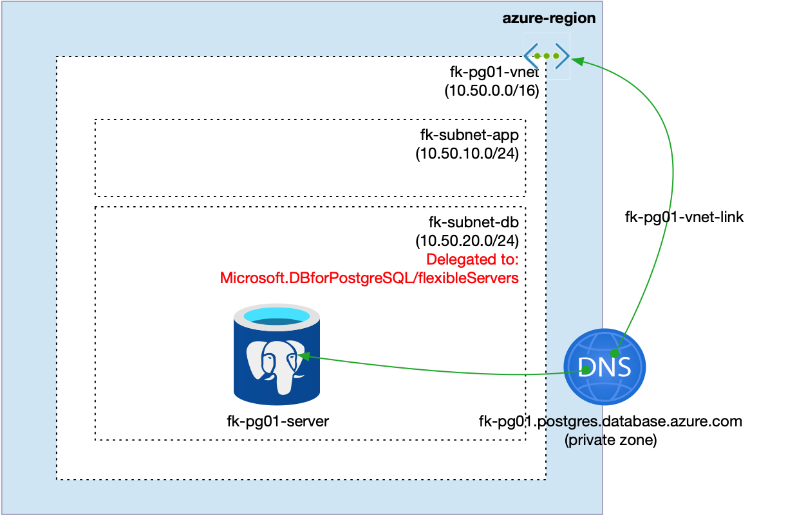
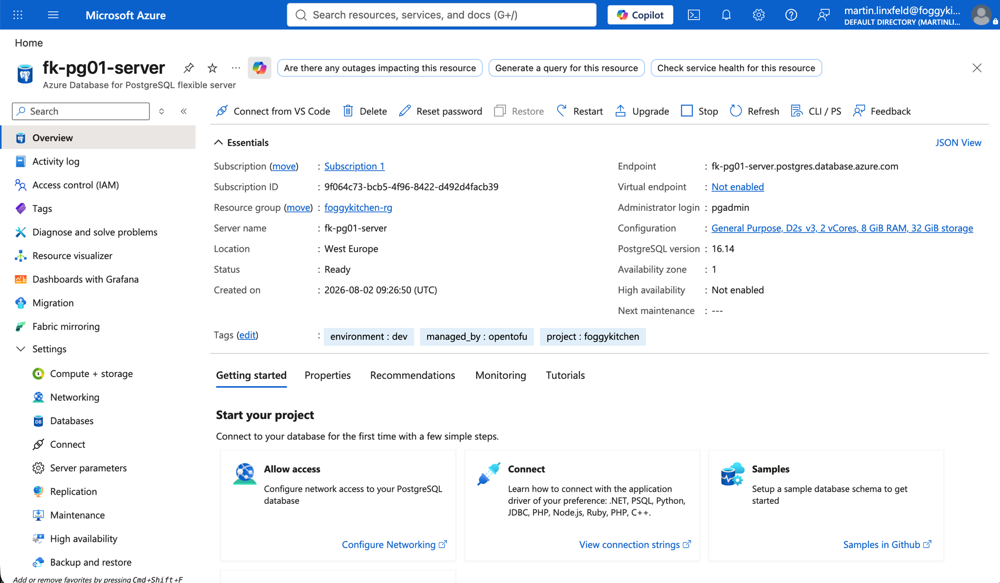
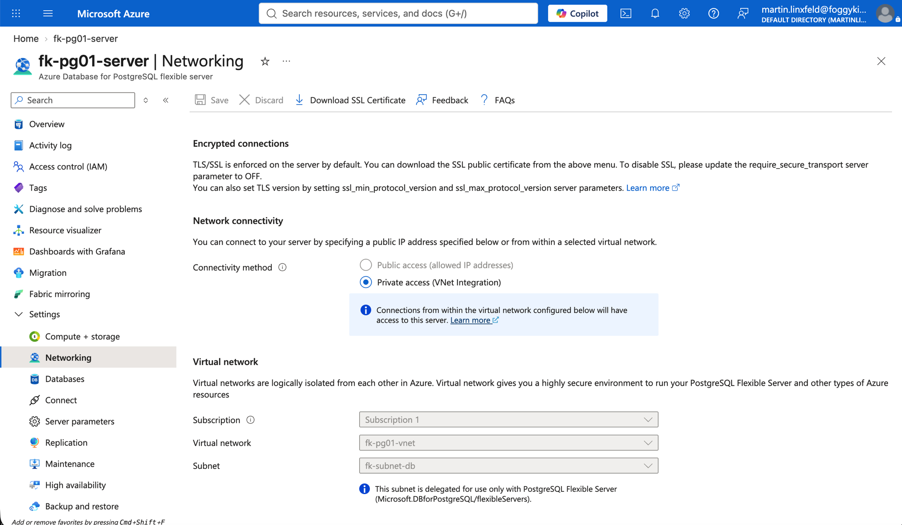
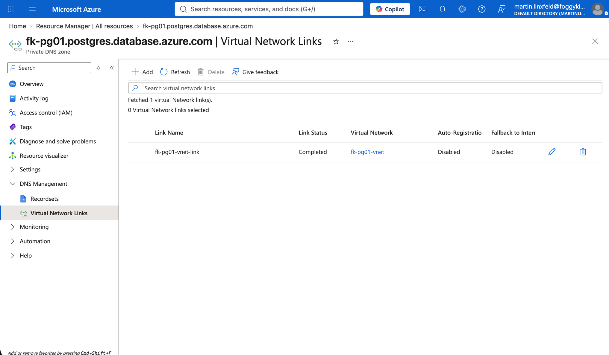
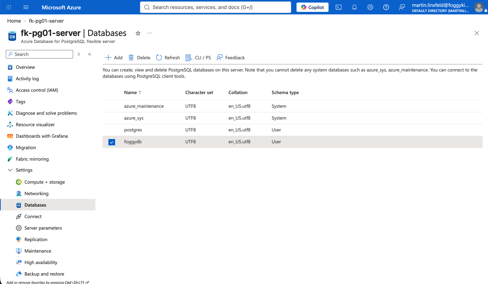

# Example 01: Private PostgreSQL Access with Delegated Subnet

In this first PostgreSQL example, we deploy an **Azure Database for PostgreSQL Flexible Server**
using **Terraform/OpenTofu**.
The server is injected into a **delegated database subnet** created by the networking module,
uses a linked **Azure Private DNS Zone**, and has public network access disabled.

This example is intentionally close to the PostgreSQL@Azure architecture used in the
FoggyKitchen multicloud training repository. It focuses on the **private access / VNet integration**
deployment path, without Private Endpoint, Bastion, or application client layers.

---

## Architecture Overview



This deployment creates:

- A dedicated **Azure Resource Group**
- One **Azure VNet** using `terraform-az-fk-vnet`
- One application subnet for future client workloads
- One database subnet delegated to `Microsoft.DBforPostgreSQL/flexibleServers`
- One **Private DNS Zone** using `terraform-az-fk-private-dns`
- One **PostgreSQL Flexible Server** using the local `terraform-az-fk-pg` module
- One sample database named `foggydb`

This is the most direct way to understand how the PostgreSQL module behaves
when the server is deployed with delegated subnet private access.

---

## Deployment Steps

Copy the example variables file and set a strong PostgreSQL administrator password:

```bash
cp terraform.tfvars.example terraform.tfvars
```

If you reuse a shared Azure training tfvars file, make sure it also provides
`pg_admin_password`. Values such as `my_public_ip` are not used by this private
access example.

Initialize and apply the Terraform/OpenTofu configuration:

```bash
tofu init
tofu plan
tofu apply
```

After a successful deployment, OpenTofu will output:

- The PostgreSQL Flexible Server ID
- The PostgreSQL FQDN
- The created database IDs
- The VNet ID
- The delegated database subnet ID

These outputs make it easy to verify that the database layer was created
and attached to the expected private networking foundation.

---

## Runtime Notes

After deployment, the PostgreSQL server should:

- have public network access disabled
- be reachable through the delegated database subnet
- resolve through the linked Private DNS Zone
- expose the `foggydb` database

Use the PostgreSQL FQDN from the outputs when building connection strings.
Avoid pinning private IP addresses because Azure can change service-assigned addresses.

---

## Azure Console And Runtime Verification

### PostgreSQL Flexible Server

In the Azure portal, verify that the PostgreSQL Flexible Server exists in the expected
resource group and region.



### Networking View

Confirm that the server is integrated with the `fk-subnet-db` delegated subnet and that
public network access is disabled.



### Private DNS

Confirm that the Private DNS Zone is linked to the VNet created by `terraform-az-fk-vnet`.
Name resolution should use a zone ending with `.postgres.database.azure.com` for this
delegated subnet private access pattern.



### Database List

Confirm that the example database `foggydb` was created on the PostgreSQL Flexible Server.



---

## Cleanup

To remove all resources created by this example:

```bash
tofu destroy
```

---

## Summary

This example demonstrates:

- How to deploy **Azure Database for PostgreSQL Flexible Server** using Terraform/OpenTofu
- How to use the PostgreSQL module with delegated subnet private access
- How to combine the module with `terraform-az-fk-vnet`
- How to combine the module with `terraform-az-fk-private-dns`
- How to keep PostgreSQL networking explicit and outside the root database module

---

## Learn More

Visit [FoggyKitchen.com](https://foggykitchen.com/) for Azure, OCI, multicloud, and Terraform/OpenTofu learning resources.

---

## License

Licensed under the **Universal Permissive License (UPL), Version 1.0**.
See [LICENSE](../../LICENSE) for more details.

---

© 2026 [FoggyKitchen.com](https://foggykitchen.com) - Cloud. Code. Clarity.
