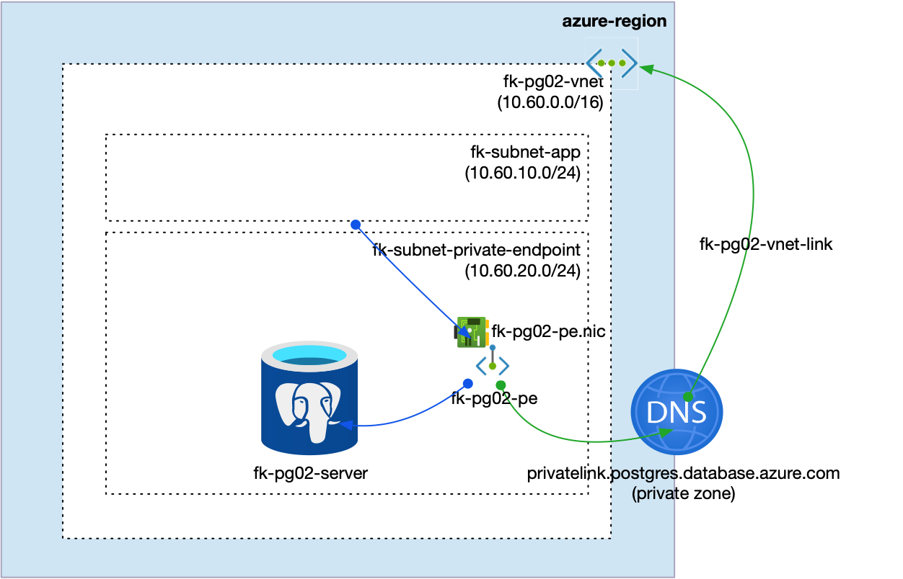
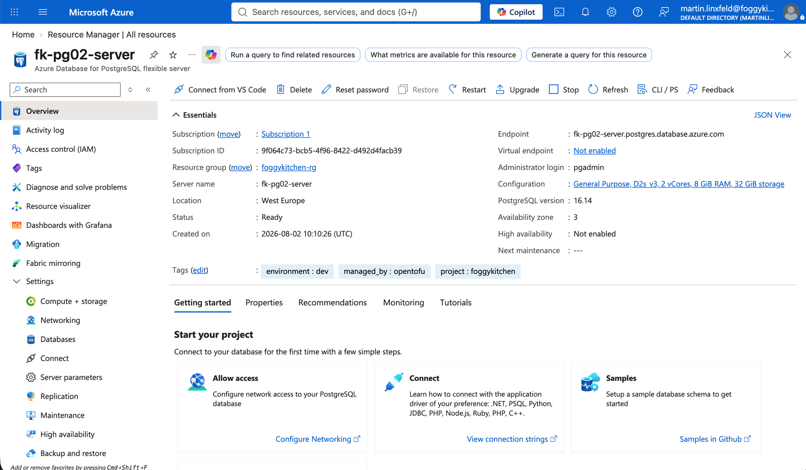
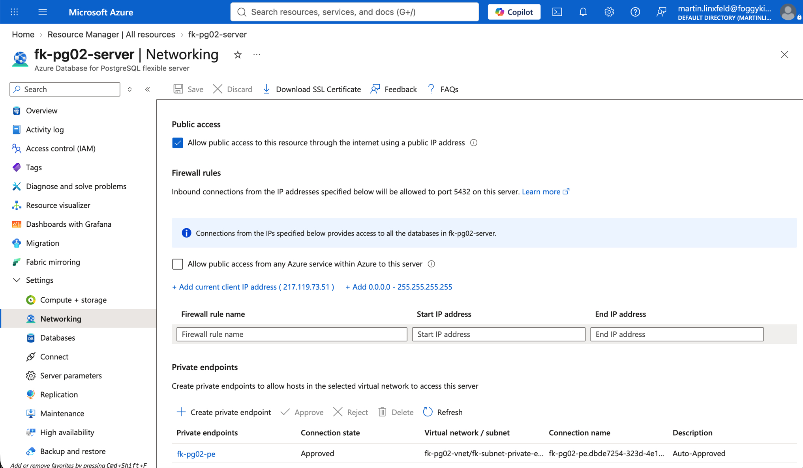
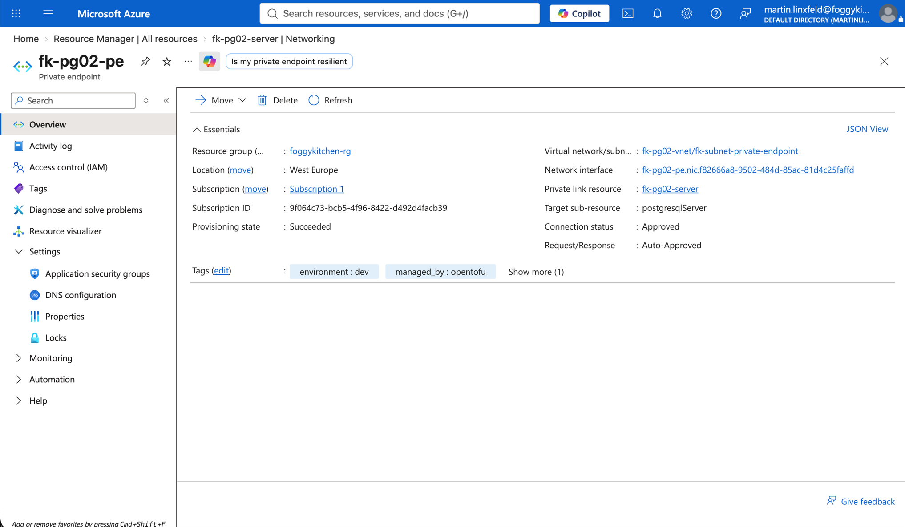
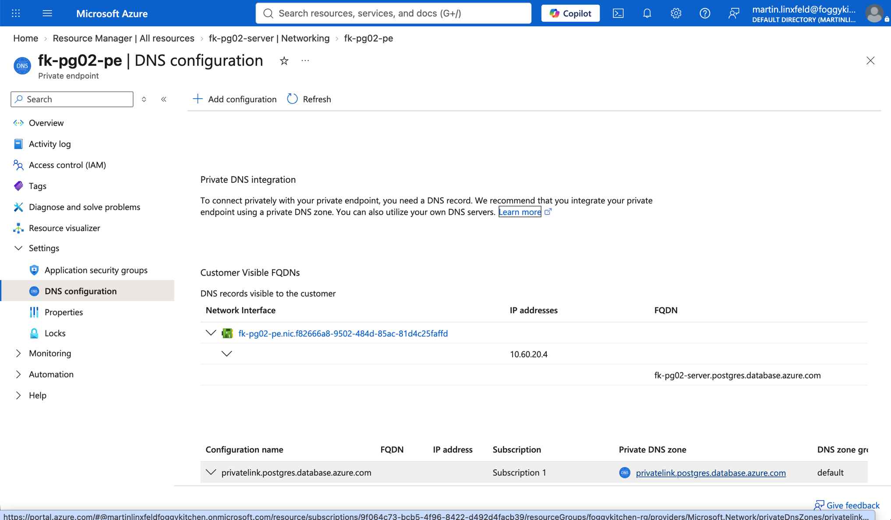
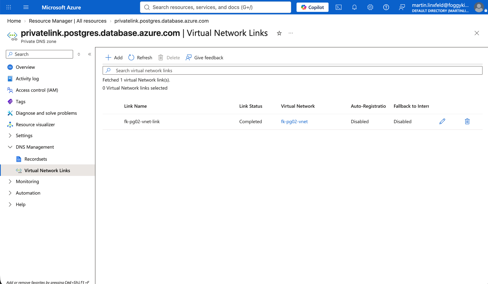
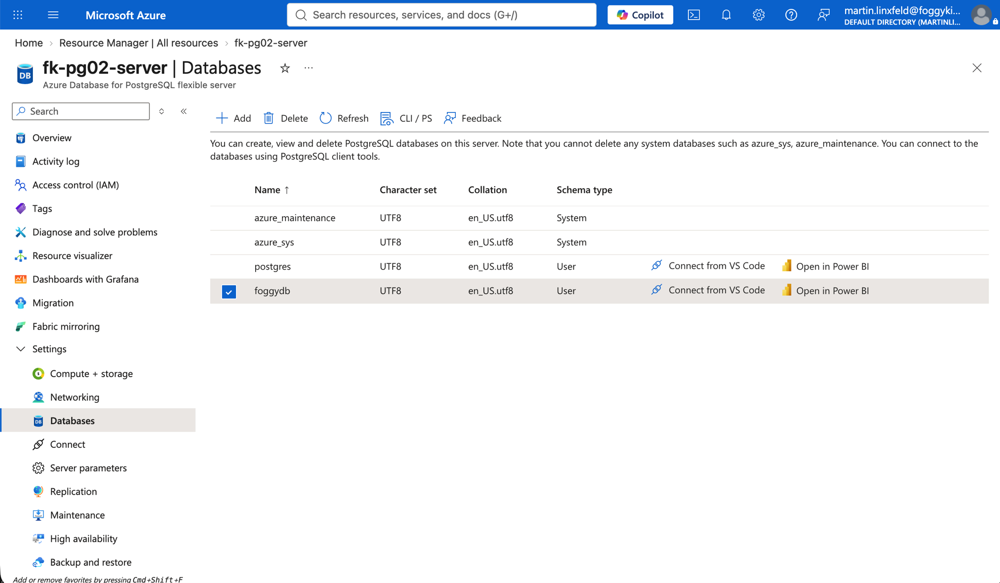

# Example 02: PostgreSQL Private Endpoint

In this second PostgreSQL example, we deploy an **Azure Database for PostgreSQL Flexible Server**
using **Terraform/OpenTofu** and expose it privately through **Azure Private Link**.
The Private Endpoint is created in a dedicated subnet and integrated with the recommended
PostgreSQL Private DNS Zone.

This example focuses on the **Private Endpoint deployment path**, where the PostgreSQL server
is composed with dedicated FoggyKitchen networking, Private DNS, and Private Endpoint modules.

---

## Architecture Overview



This deployment creates:

- A dedicated **Azure Resource Group**
- One **Azure VNet** using `terraform-az-fk-vnet`
- One application subnet for future client workloads
- One subnet prepared for Private Endpoints
- One **Private DNS Zone** using `terraform-az-fk-private-dns`
- One **PostgreSQL Flexible Server** using the local `terraform-az-fk-pg` module
- One **Private Endpoint** using `terraform-az-fk-private-endpoint`
- One Private DNS Zone Group attached to the Private Endpoint
- One sample database named `foggydb`

This is the most direct way to understand how the PostgreSQL module can be composed
with Private Link while keeping endpoint and DNS concerns outside the root database module.

---

## Deployment Steps

Copy the example variables file and set a strong PostgreSQL administrator password:

```bash
cp terraform.tfvars.example terraform.tfvars
```

If you reuse a shared Azure training tfvars file, make sure it also provides
`pg_admin_password`. Values such as `my_public_ip` are not used by this Private
Endpoint example.

Initialize and apply the Terraform/OpenTofu configuration:

```bash
tofu init
tofu plan
tofu apply
```

After a successful deployment, OpenTofu will output:

- The PostgreSQL Flexible Server ID
- The PostgreSQL FQDN
- The Private Endpoint ID
- The Private Endpoint IP addresses
- The created database IDs

These outputs make it easy to verify that the database exists and that Private Link
has been attached to the PostgreSQL server.

---

## Runtime Notes

After deployment, the PostgreSQL server should:

- be associated with a Private Endpoint
- resolve through `privatelink.postgres.database.azure.com`
- expose the `foggydb` database
- accept private connectivity from clients with network path to the Private Endpoint subnet

The PostgreSQL Private Endpoint target subresource is `postgresqlServer`.
This example does not create firewall rules, so public network access is enabled for the
server object but no public client IPs are allowed by this configuration.

---

## Azure Console And Runtime Verification

### PostgreSQL Flexible Server

In the Azure portal, verify that the PostgreSQL Flexible Server exists in the expected
resource group and region.



### PostgreSQL Networking

Confirm that the PostgreSQL Flexible Server is associated with the Private Endpoint
and that no firewall rules are required for the private access path.



### Private Endpoint

Confirm that the Private Endpoint is connected to the PostgreSQL Flexible Server and that
the private service connection is approved.



### Private Endpoint DNS Configuration

Confirm that the Private Endpoint DNS configuration exposes the PostgreSQL FQDN and
private IP address from the Private Endpoint subnet.



### Private DNS

Confirm that the Private DNS Zone Group is attached to the Private Endpoint and references
`privatelink.postgres.database.azure.com`.



### Database List

Confirm that the example database `foggydb` was created on the PostgreSQL Flexible Server.



---

## Cleanup

To remove all resources created by this example:

```bash
tofu destroy
```

---

## Summary

This example demonstrates:

- How to deploy **Azure Database for PostgreSQL Flexible Server** using Terraform/OpenTofu
- How to compose the PostgreSQL module with `terraform-az-fk-private-endpoint`
- How to use `terraform-az-fk-private-dns` for Private Endpoint DNS integration
- How to use the PostgreSQL Private Link subresource `postgresqlServer`
- How to keep Private Endpoint concerns outside the root PostgreSQL module

---

## Learn More

Visit [FoggyKitchen.com](https://foggykitchen.com/) for Azure, OCI, multicloud, and Terraform/OpenTofu learning resources.

---

## License

Licensed under the **Universal Permissive License (UPL), Version 1.0**.
See [LICENSE](../../LICENSE) for more details.

---

© 2026 [FoggyKitchen.com](https://foggykitchen.com) - Cloud. Code. Clarity.
