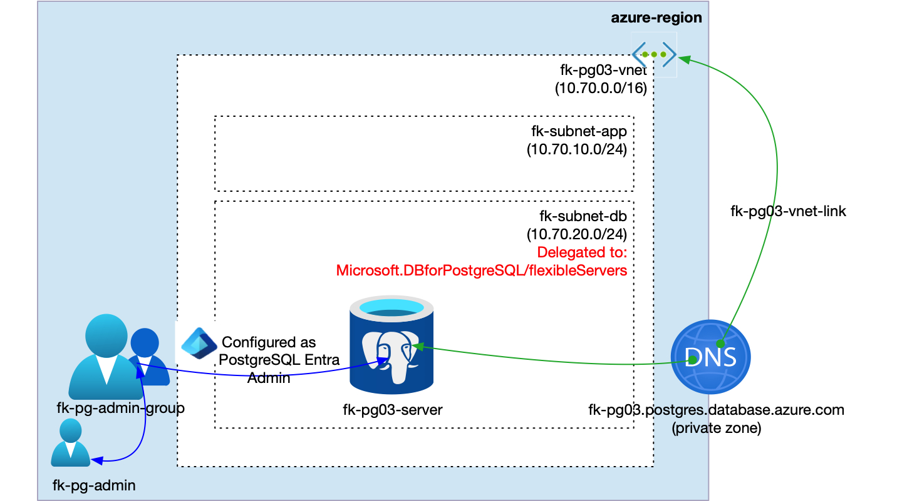
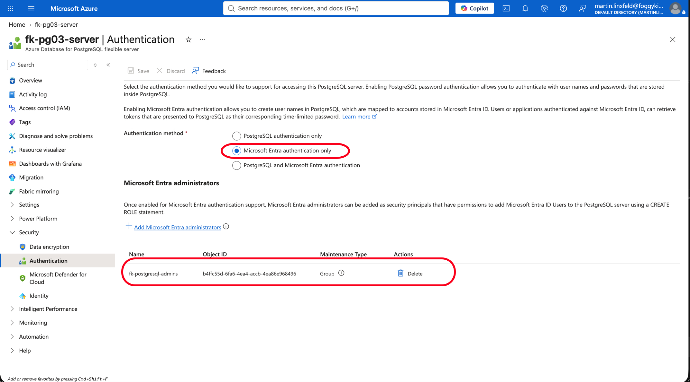
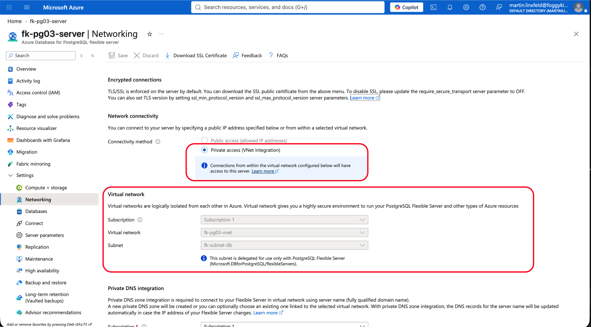
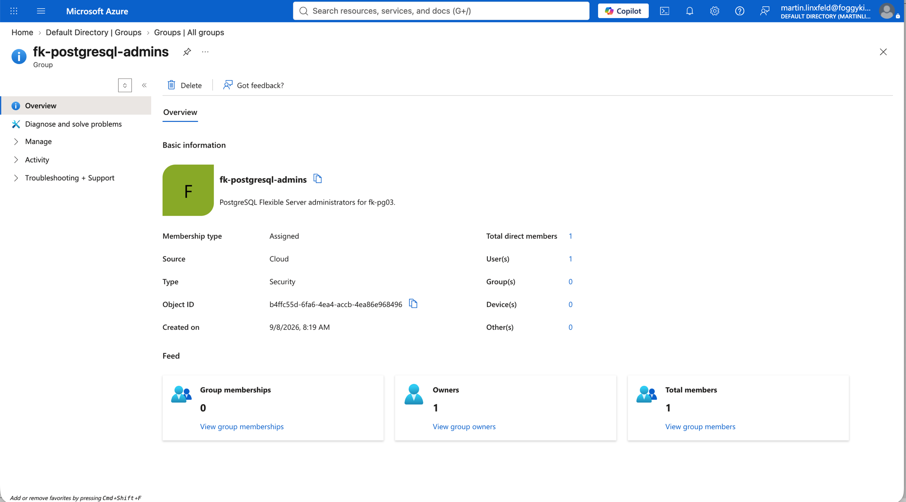
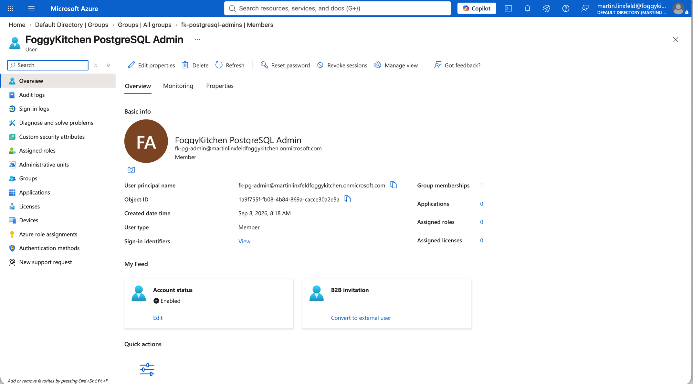
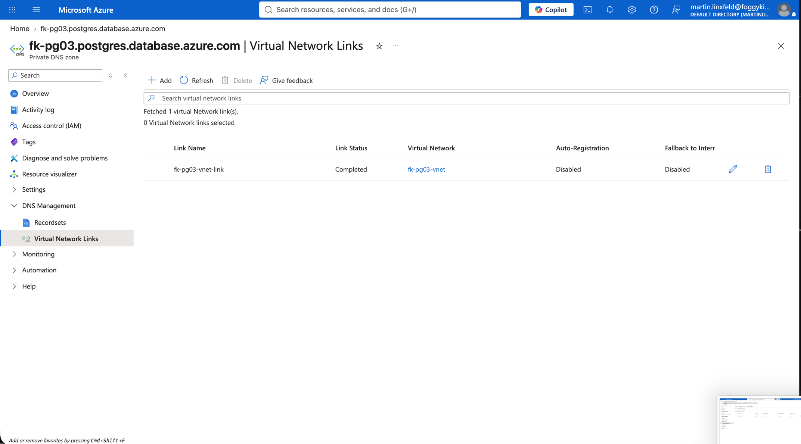

# Example 03: Microsoft Entra Authentication

In this third PostgreSQL example, we deploy an **Azure Database for PostgreSQL Flexible Server**
using **Terraform/OpenTofu** with **Microsoft Entra ID authentication** enabled.
The server is injected into a delegated database subnet, uses a linked Azure Private DNS Zone,
and configures a Microsoft Entra security group as the PostgreSQL administrator.

Password authentication is disabled in this example. The lab creates a Microsoft Entra user
with `terraform-az-fk-entra-user`, creates a Microsoft Entra security group with
`terraform-az-fk-entra-group`, adds the user to the group, and maps the group to the
PostgreSQL Flexible Server administrator role.

---

## Architecture Overview



This deployment creates:

- A dedicated **Azure Resource Group**
- One **Microsoft Entra user** using `terraform-az-fk-entra-user`
- One **Microsoft Entra security group** using `terraform-az-fk-entra-group`
- One **Azure VNet** using `terraform-az-fk-vnet`
- One application subnet for future client workloads
- One database subnet delegated to `Microsoft.DBforPostgreSQL/flexibleServers`
- One **Private DNS Zone** using `terraform-az-fk-private-dns`
- One **PostgreSQL Flexible Server** using the local `terraform-az-fk-pg` module
- One Microsoft Entra group administrator mapped to PostgreSQL
- One sample database named `foggydb`

This example demonstrates an identity-first PostgreSQL deployment path where database
administration is assigned to a Microsoft Entra group instead of an individual principal.

---

## Deployment Steps

Copy the example variables file and set a real Microsoft Entra tenant domain and strong
initial password for the Entra administrator user:

```bash
cp terraform.tfvars.example terraform.tfvars
```

Update `entra_admin_user_principal_name` to use a verified tenant domain. The Entra user
password is marked sensitive and is not hardcoded in the module.

Initialize and apply the Terraform/OpenTofu configuration:

```bash
tofu init
tofu plan
tofu apply
```

After a successful deployment, OpenTofu will output:

- The PostgreSQL Flexible Server ID
- The PostgreSQL FQDN
- Whether Entra authentication is enabled
- The configured Entra administrator principal names
- The Entra administrator user and group object IDs
- The created database IDs

These outputs make it easy to verify that PostgreSQL authentication is connected to the
expected Entra group.

---

## Runtime Notes

After deployment, the PostgreSQL server should:

- have Microsoft Entra authentication enabled
- have password authentication disabled
- use a Microsoft Entra group as the PostgreSQL administrator
- be reachable through the delegated database subnet
- resolve through the linked Private DNS Zone
- expose the `foggydb` database

To connect with an Entra principal, obtain an access token for Azure Database for PostgreSQL
and use the token as the PostgreSQL password.

```bash
az account get-access-token --resource-type oss-rdbms --query accessToken -o tsv
```

The PostgreSQL client must run from a network path that can resolve the private DNS zone
and reach the delegated subnet private access endpoint.

---

## Azure Console And Runtime Verification

### PostgreSQL Authentication

Confirm that Microsoft Entra authentication is enabled and password authentication is disabled
for the PostgreSQL Flexible Server.



### PostgreSQL Networking

Confirm that the server is integrated with the delegated database subnet and uses private access.



### Microsoft Entra Group

Confirm that the Microsoft Entra security group exists and is used as the PostgreSQL administrator.



### Microsoft Entra Group Membership

Confirm that the administrator user is a member of the Entra administrator group.



### Private DNS

Confirm that the Private DNS Zone is linked to the VNet created by `terraform-az-fk-vnet`.



---

## Cleanup

To remove all resources created by this example:

```bash
tofu destroy
```

---

## Summary

This example demonstrates:

- How to enable **Microsoft Entra ID authentication** for PostgreSQL Flexible Server
- How to disable password authentication for an identity-first database lab
- How to create an Entra user with `terraform-az-fk-entra-user`
- How to create an Entra administrator group with `terraform-az-fk-entra-group`
- How to combine Entra authentication with delegated subnet private access

---

## Learn More

Visit [FoggyKitchen.com](https://foggykitchen.com/) for Azure, OCI, multicloud, and Terraform/OpenTofu learning resources.

---

## License

Licensed under the **Universal Permissive License (UPL), Version 1.0**.
See [LICENSE](../../LICENSE) for more details.

---

© 2026 [FoggyKitchen.com](https://foggykitchen.com) - Cloud. Code. Clarity.
