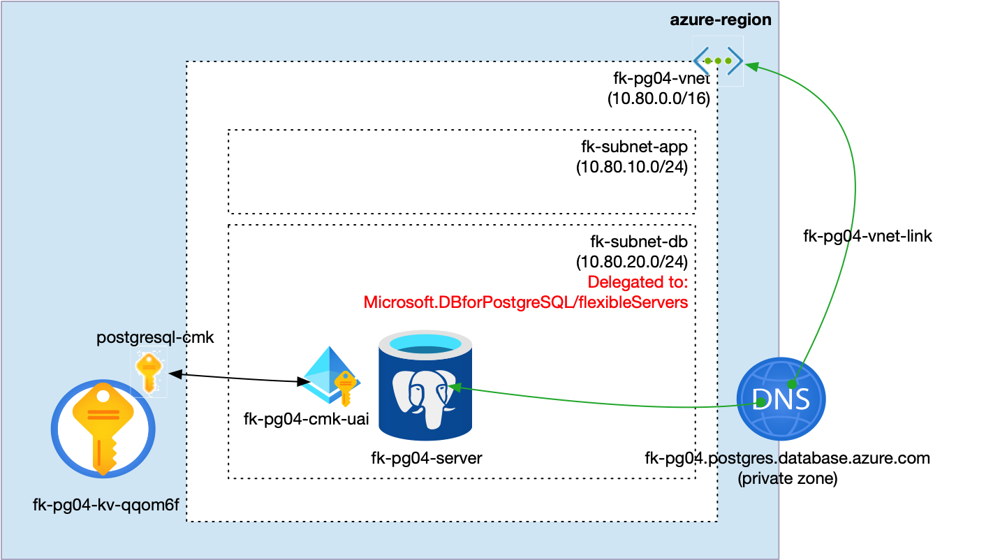
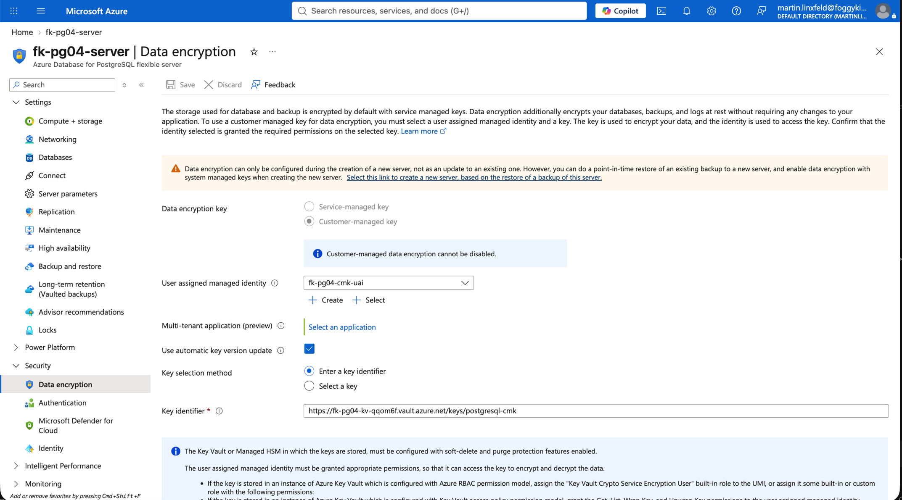
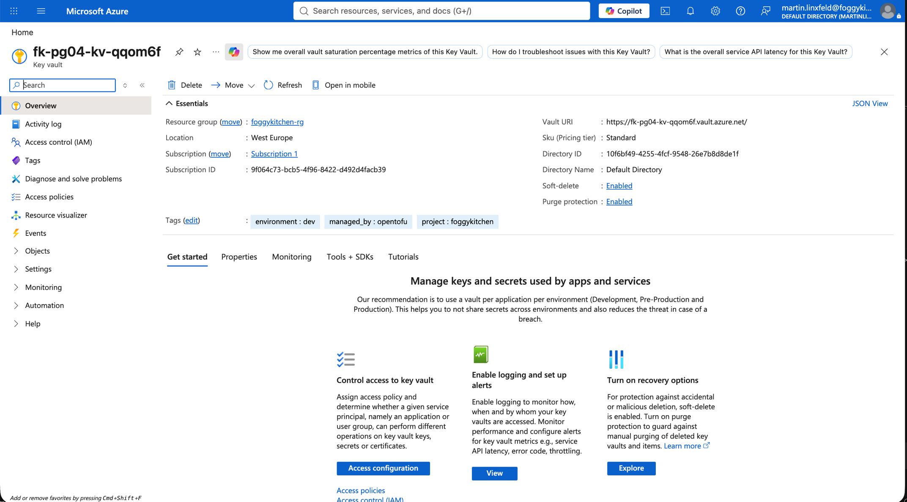
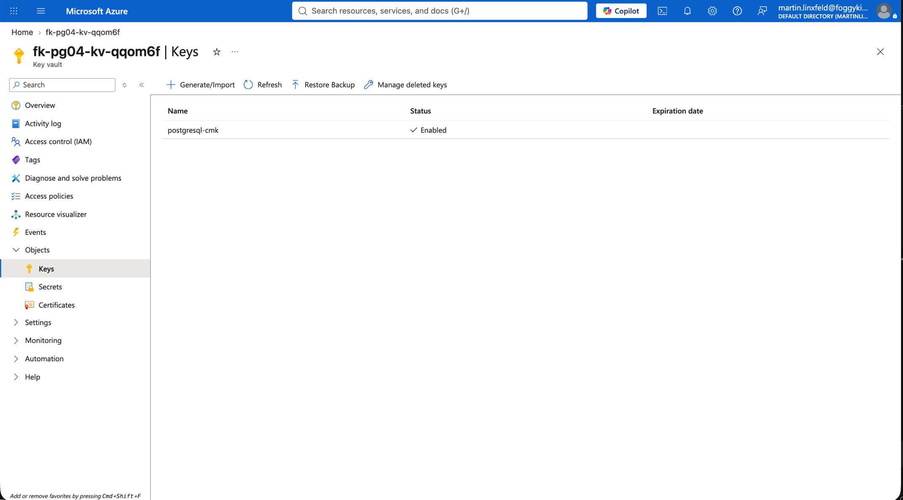
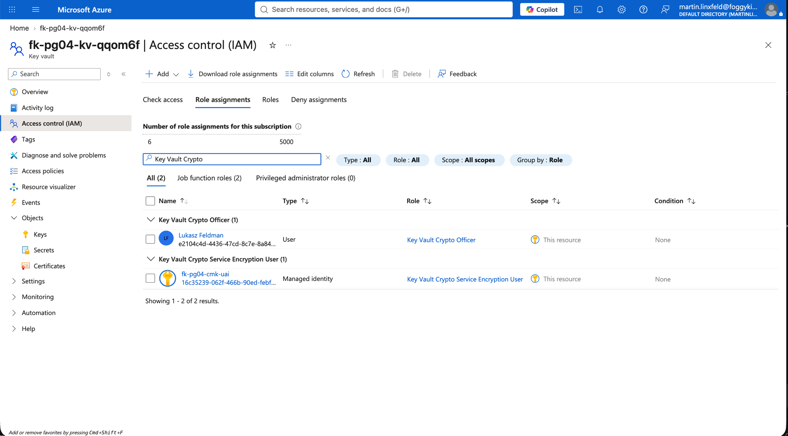
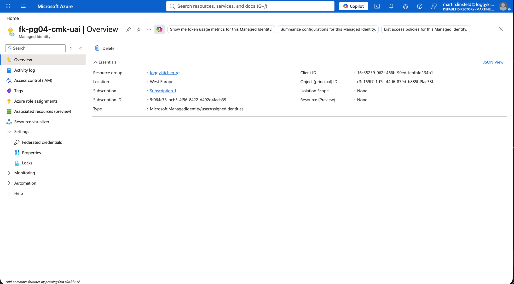

# Example 04 - Customer-Managed Key Encryption

This example deploys Azure Database for PostgreSQL Flexible Server with private access through a delegated subnet and customer-managed key encryption at rest.

The example creates the Key Vault with `terraform-az-fk-key-vault`, creates the Key Vault key with `terraform-az-fk-key-vault-key`, creates the user-assigned identity with `terraform-az-fk-managed-identity`, and grants Key Vault crypto access with `terraform-az-fk-rbac`. The PostgreSQL server receives the Key Vault key ID and identity ID from this composed lab.

## Architecture



- Resource group
- Key Vault composed with `terraform-az-fk-key-vault`
- RSA Key Vault key composed with `terraform-az-fk-key-vault-key`
- User-assigned managed identity composed with `terraform-az-fk-managed-identity`
- Key Vault RBAC assignments composed with `terraform-az-fk-rbac`
- VNet with an application subnet and a delegated PostgreSQL subnet
- Private DNS Zone linked to the VNet
- PostgreSQL Flexible Server with CMK encryption
- One sample database

## Usage

```bash
cd examples/04_customer_managed_key
cp terraform.tfvars.example terraform.tfvars
tofu init
tofu plan
```

Update `terraform.tfvars` with a strong PostgreSQL password before planning.

The Key Vault uses Azure RBAC and purge protection, which are required for a realistic PostgreSQL CMK setup. The principal running OpenTofu receives `Key Vault Crypto Officer` so it can create the key, and the PostgreSQL user-assigned identity receives `Key Vault Crypto Service Encryption User` so the service can wrap and unwrap the data encryption key.

## Validation Screenshots

The following Azure Portal screenshots show the deployed CMK configuration:










