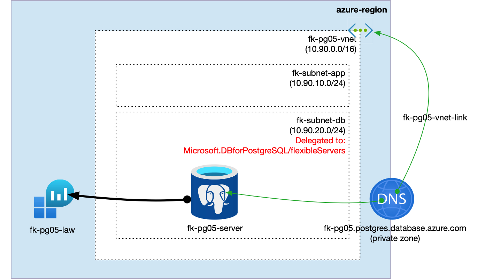
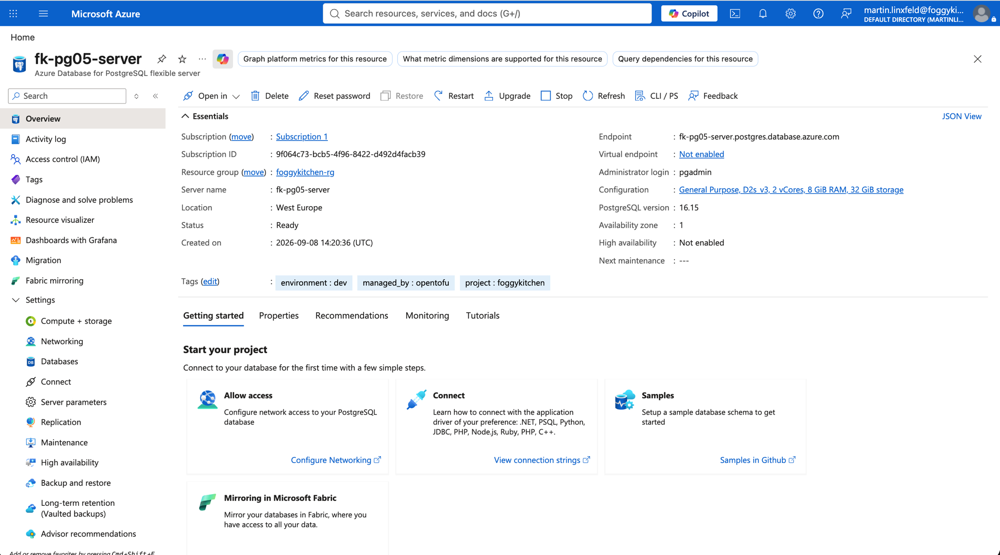
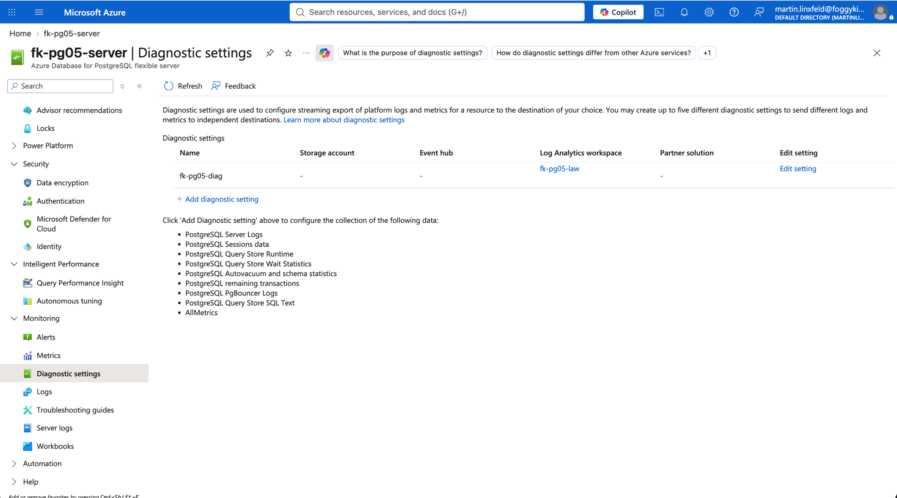
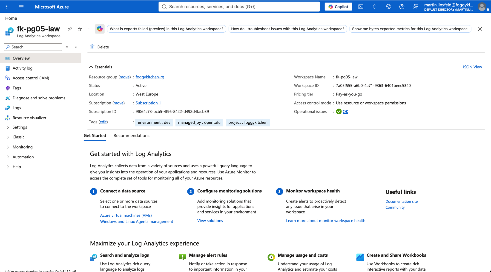
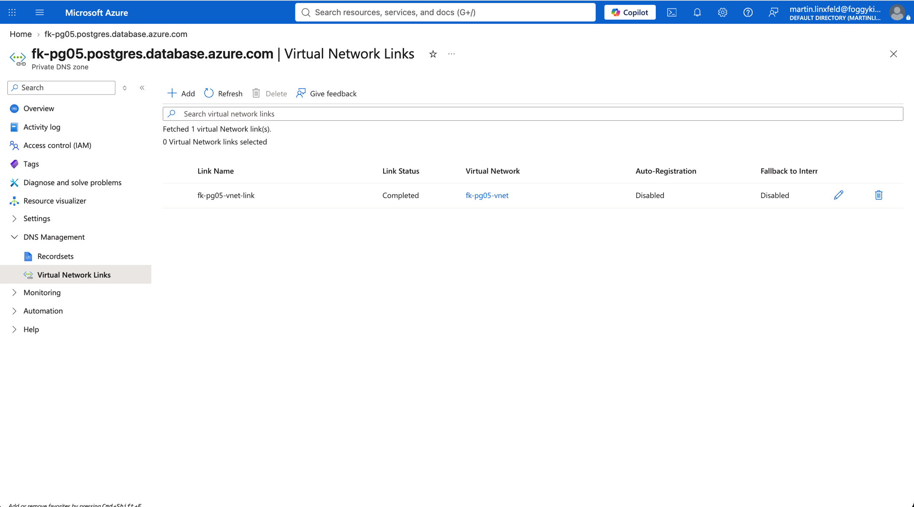

# Example 05 - Diagnostic Settings

This example deploys Azure Database for PostgreSQL Flexible Server with private access through a delegated subnet and sends logs and metrics to a Log Analytics workspace.

The example creates the workspace with `terraform-az-fk-log-analytics`. The PostgreSQL module owns the diagnostic setting in this example so task 05 demonstrates the new `diagnostic_settings` input directly.

## Architecture



- Resource group
- Log Analytics Workspace composed with `terraform-az-fk-log-analytics`
- VNet with an application subnet and a delegated PostgreSQL subnet
- Private DNS Zone linked to the VNet
- PostgreSQL Flexible Server
- Azure Monitor diagnostic setting using the `allLogs` log category group and `AllMetrics`
- One sample database

## Usage

```bash
cd examples/05_diagnostics
cp terraform.tfvars.example terraform.tfvars
tofu init
tofu plan
```

Update `terraform.tfvars` with a strong PostgreSQL password before planning.

The workspace is created by the FoggyKitchen Log Analytics module. The PostgreSQL module receives only the workspace resource ID and creates one diagnostic setting with the `allLogs` category group and `AllMetrics`.

## Runtime Notes

The PostgreSQL server is deployed with private access through a delegated subnet. Azure Monitor diagnostic settings are attached directly to the PostgreSQL Flexible Server resource and send platform logs and metrics to the workspace created in the same lab.

The example uses the `allLogs` category group instead of enumerating each log category. Azure Monitor does not allow mixing explicit log categories and category groups in the same diagnostic setting, so explicit categories should be used with `log_category_groups = []`.

## Validation Screenshots

The following Azure Portal screenshots show the deployed diagnostic settings configuration:









## Cleanup

```bash
tofu destroy
```

The lab creates billable Azure resources. Destroy the deployment after validation if it is not needed.
